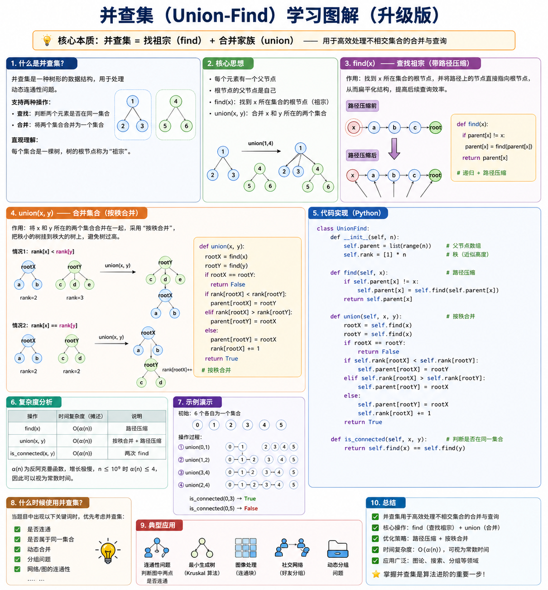

# 并查集

> 标签：#算法 #数据结构 #模板题 #图论

---

## 做题心得
`parent`列表初始化建好后， 之后的更新都在`union`操作中完成，只需要关注各个元素之间的联系即可

---

## 一句话总结

并查集是一种用来高效维护“元素之间是否属于同一个集合”的数据结构，核心操作是查询代表节点 `find` 和合并集合 `union`。

<p align="center">
  
</p>

---

## 核心问题

并查集解决的是“动态分组 / 动态连通性”问题。

题目通常会给你一批元素，然后不断告诉你某两个元素之间有关系。你需要把有关系的元素归到同一个集合里，并且能够快速回答它们之间的关系。

核心操作：

1. 判断两个元素是否在同一个集合里。
2. 把两个元素所在的集合合并成一个集合。

也就是说，并查集关心的不是两个元素之间的具体路径，而是它们最终是否属于同一组。

典型应用：

- 判断图中两个点是否连通。
- 判断无向图中是否存在环。
- 统计连通块数量。
- 朋友圈、岛屿数量、账户合并等分组问题。
- Kruskal 最小生成树算法。

---

## 核心思想

把每个集合看成一棵树，树中的每个节点都有一个父节点 `parent[x]`。

每个集合都有一个代表节点，也叫根节点。根节点的特点是：

```python
parent[x] == x
```

判断两个元素是否属于同一个集合，本质上就是看它们的根节点是否相同：

```python
find(a) == find(b)
```

合并两个集合，本质上就是让其中一个集合的根节点指向另一个集合的根节点。

---

## 核心操作 / 关键步骤

### 1. 初始化

每个元素一开始都是一个单独的集合，自己就是自己的父节点。

```python
parent = [i for i in range(n)]
```

如果要统计集合数量，可以额外维护：

```python
count = n
```

---

### 2. find：查找根节点

作用：找到 `x` 所在集合的代表节点。

普通写法：

```python
def find(x):
    while parent[x] != x:
        x = parent[x]
    return x
```

优化写法：路径压缩。

路径压缩的作用是：在查找根节点的过程中，把沿途节点直接挂到根节点下面，让后续查询更快。

```python
def find(x):
    if parent[x] != x:
        parent[x] = find(parent[x])
    return parent[x]
```

---

### 3. union：合并两个集合

作用：把 `a` 和 `b` 所在的集合合并。

步骤：

1. 找到 `a` 的根节点 `root_a`。
2. 找到 `b` 的根节点 `root_b`。
3. 如果两个根节点不同，就让其中一个根节点指向另一个根节点。

```python
def union(a, b):
    root_a = find(a)
    root_b = find(b)

    if root_a == root_b:
        return False

    parent[root_b] = root_a
    return True
```

`union` 返回值常见含义：

- `True`：原来不在同一集合，已经成功合并。
- `False`：原来就在同一集合，不需要合并。

---

## 模板代码

### 基础模板

```python
class UnionFind:
    def __init__(self, n):
        self.parent = [i for i in range(n)]
        self.count = n

    def find(self, x):
        if self.parent[x] != x:
            self.parent[x] = self.find(self.parent[x])
        return self.parent[x]

    def union(self, a, b):
        root_a = self.find(a)
        root_b = self.find(b)

        if root_a == root_b:
            return False

        self.parent[root_b] = root_a
        self.count -= 1
        return True

    def connected(self, a, b):
        return self.find(a) == self.find(b)
```

---

### 按秩合并模板

`rank` 可以理解为树的高度。合并时让矮树挂到高树下面，避免树变得太深。

```python
class UnionFind:
    def __init__(self, n):
        self.parent = [i for i in range(n)]
        self.rank = [1] * n
        self.count = n

    def find(self, x):
        if self.parent[x] != x:
            self.parent[x] = self.find(self.parent[x])
        return self.parent[x]

    def union(self, a, b):
        root_a = self.find(a)
        root_b = self.find(b)

        if root_a == root_b:
            return False

        if self.rank[root_a] < self.rank[root_b]:
            self.parent[root_a] = root_b
        elif self.rank[root_a] > self.rank[root_b]:
            self.parent[root_b] = root_a
        else:
            self.parent[root_b] = root_a
            self.rank[root_a] += 1

        self.count -= 1
        return True

    def connected(self, a, b):
        return self.find(a) == self.find(b)
```

---

## 复杂度

使用路径压缩和按秩合并后：

- `find`：近似 $O(1)$
- `union`：近似 $O(1)$
- 空间复杂度：$O(n)$

严格来说，单次操作复杂度是 $O(\alpha(n))$，其中 $\alpha(n)$ 是反阿克曼函数，增长极慢，实际做题时可以当成常数。

---

## 常见题型

### 1. 判断是否连通

如果题目给出很多连接关系，再问两个点是否连通，可以用并查集。

```python
uf.union(a, b)
uf.connected(x, y)
```

---

### 2. 统计连通块数量

一开始有 `n` 个集合，每成功合并一次，集合数量减一。

```python
if uf.union(a, b):
    count -= 1
```

或者直接使用模板里的：

```python
uf.count
```

---

### 3. 判断无向图是否有环

遍历每条边 `(a, b)`：

- 如果 `a` 和 `b` 已经在同一个集合，说明再加这条边会形成环。
- 否则合并它们。

```python
for a, b in edges:
    if uf.connected(a, b):
        return True
    uf.union(a, b)
```

---

## 易错点

- `find(x)` 返回的是根节点，不一定是 `x` 的直接父节点。
- `union(a, b)` 合并的是两个根节点，不是直接让 `a` 指向 `b`。
- 如果题目元素编号从 `1` 开始，初始化时通常要开 `n + 1` 的数组。
- 二维坐标题可以把 `(i, j)` 映射成一维编号：

```python
index = i * cols + j
```

---

## 记忆口诀

```text
初始化：自己指向自己
find：一路找到老大
路径压缩：路过的人都直接认老大
union：两个集合的老大合并
connected：看老大是不是同一个
```
